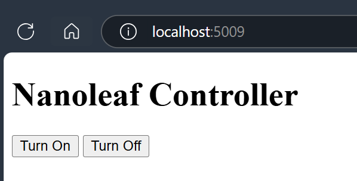

A simple webapp to allow people on my home network to control the lights from a browser. 



### Run it:
```
docker run -p 8080:8080 `
--rm -it -e Nanoleaf__IpAddress="YOUR_IP" `
-e Nanoleaf__AUTHTOKEN="YOUR_TOKEN" `
ghcr.io/mitchfen/nanoleaf-controller:latest
```